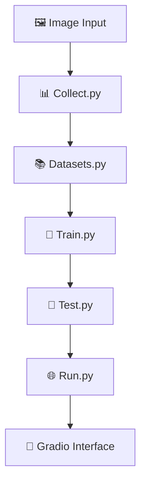

# 🤖 Simple AI Image Classification

<div align="center">


### 🎯 **99.81% Accuracy** | 🚀 **Real-time Inference** | 🌐 **Easy Deployment**

⭐ **Star this repo if it helps you!** ⭐

🔥 **Share it with the community!** 🔥

[](https://x.com/intent/tweet?text=Check%20out%20this%20amazing%20AI%20Image%20Classification%20project!%20🤖✨%20https://github.com/Mushrum-mmb/Simple-AI-Image-Classification%20%23AI%20%23MachineLearning%20%23DeepLearning)
[](https://www.facebook.com/sharer/sharer.php?u=https://github.com/Mushrum-mmb/Simple-AI-Image-Classification)
[](https://www.linkedin.com/sharing/share-offsite/?url=https://github.com/Mushrum-mmb/Simple-AI-Image-Classification)
[](https://www.reddit.com/submit?title=Amazing%20AI%20Image%20Classification%20Project&url=https://github.com/Mushrum-mmb/Simple-AI-Image-Classification)

</div>

---

## 📋 Table of Contents

<details>
<summary>🔍 <strong>Click to expand navigation</strong></summary>

- [🚀 About](#-about)
- [✨ Features](#-features)
- [⬇️ Installation](#️-installation)
- [▶️ Usage](#️-usage)
- [💻 Google Colab Usage](#-google-colab-usage)
- [🔧 How It Works](#-how-it-works)
- [📈 Performance](#-performance)
- [🤝 Contributing](#-contributing)
- [📜 License](#-license)

</details>

---

## 🚀 About

<div align="center">

**🎯 Cutting-edge AI image classification powered by deep learning!**

</div>

This sophisticated AI application leverages the power of **ResNet-50** architecture to perform highly accurate image classification. Trained on carefully curated private datasets, it specializes in animal category prediction with remarkable precision.

<div align="center">

| 🎯 **Accuracy** | 🚀 **Model** | 🛠️ **Framework** | 👨‍💻 **Author** |
|:---:|:---:|:---:|:---:|
| **99.81%** | ResNet-50 | Gradio | [Mushrum-mmb](https://github.com/Mushrum-mmb/) |

</div>

### 🌟 **Key Highlights:**
- 🔥 **State-of-the-art accuracy** at 99.81%
- ⚡ **Real-time predictions** with confidence scores
- 🌐 **Web-based interface** for easy access
- 🚀 **GPU acceleration** support
- 📱 **Cross-platform compatibility**


---

## 📈 Performance

<div align="center">

### 🎯 **Current Model Performance**


> **Note:** This exceptional accuracy is calculated from validation datasets. Real-world performance may vary.

</div>

<div align="center">


</div>

<div align="center">


</div>

---

## ✨ Features

<div align="center">

### 🎭 **What Makes This Special?**

</div>

| Feature | Description | Benefit |
|---------|-------------|---------|
| 🖼️ **Image Classification** | Upload images for instant animal category prediction | Quick and accurate results |
| 🧠 **Pre-trained Model** | ResNet-50 architecture fine-tuned on animal datasets | Superior accuracy and reliability |
| ⚡ **Real-time Inference** | Instant predictions with confidence percentages | Immediate feedback for users |
| 🚀 **GPU Acceleration** | Automatic GPU detection and utilization | Lightning-fast processing |
| 🌐 **Easy Deployment** | One-command launch with public sharing option | Hassle-free setup and sharing |
| 💻 **Google Colab Ready** | Optimized for cloud-based training and testing | Perfect for low-spec devices |

<div align="center">

### 🎯 **Perfect For:**
🎓 **Students** • 🔬 **Researchers** • 👨‍💻 **Developers** • 🏢 **Businesses**

</div>

---

## ⬇️ Installation

<div align="center">

### 🛠️ **Get Started in Minutes!**

</div>

> **📋 Prerequisites:** Ensure you have Git installed and Python environment set up.

<details>
<summary>🔧 <strong>For Local Installation (Click to expand)</strong></summary>

**Step 1:** Install required dependencies
```bash
pip install torch torchvision gradio opencv-python scikit-learn matplotlib tensorboard tqdm requests beautifulsoup4
```

**Step 2:** Download training artifacts
- 📥 Go to [Releases](https://github.com/Mushrum-mmb/Simple-AI-Image-Classification/releases/tag/Training_artifacts)
- 📁 Download `Training artifacts.zip`
- 📂 Extract the zip file

</details>

<details>
<summary>☁️ <strong>For Google Colab Users (Click to expand)</strong></summary>

**Good news!** Skip local installation and use our cloud-ready setup:
- 📥 Download only the `Training artifacts.zip` file
- 🚫 No need to unzip - we'll handle that in Colab!

</details>

---

## ▶️ Usage

<div align="center">

### 🚀 **Launch Your AI in 3 Simple Steps!**

</div>

**Step 1:** Clone the repository
```bash
git clone https://github.com/Mushrum-mmb/Simple-AI-Image-Classification.git
```

**Step 2:** Navigate to project directory
```bash
cd Simple-AI-Image-Classification
```

**Step 3:** Launch the application
```bash
python run.py --checkpoint "path/to/your/checkpoint/folder"
```

<div align="center">

### 📱 **Example Usage:**
```bash
python run.py --checkpoint "C:\Users\DELL\Downloads\Training artifacts\checkpoint"
```

### 🎉 **Your AI is Ready!**
Open the provided link in your browser and start classifying images!

</div>


---

## 💻 Google Colab Usage

<div align="center">

### ☁️ **Perfect for Potato Computers!** 🥔

[](https://colab.research.google.com/drive/13yuj3zqh8ed1wi9KkUfnDeBKN0ZYgel1?usp=sharing)

</div>

Can't run AI on your device? No problem! Use our optimized Google Colab notebook for seamless cloud-based AI training and inference.

<details>
<summary>📖 <strong>Step-by-Step Colab Guide (Click to expand)</strong></summary>

**Step 1:** Navigate to the Gradio installation section


**Step 2:** Run the installation cell


**Step 3:** Upload `Training_artifacts.zip` to `/content`


**Step 4:** Verify upload completion


**Step 5:** Execute the processing cell


**Step 6:** Launch and enjoy! 🎉

</details>

---

## 🔧 How It Works

<div align="center">

### 🏗️ **Architecture Overview**

</div>

Our AI system consists of five core components working in harmony:

<div align="center">



</div>

| Component | Purpose | Key Features |
|-----------|---------|-------------|
| 🔍 **Collect.py** | Data Collection | • Automated Google Images scraping<br>• Smart URL parsing and validation<br>• Structured file organization |
| 📚 **Datasets.py** | Data Management | • Custom PyTorch dataset class<br>• Image normalization and transforms<br>• Train/test data splitting |
| 🎯 **Train.py** | Model Training | • ResNet-50 architecture implementation<br>• TensorBoard logging integration<br>• Automatic checkpoint saving |
| 🧪 **Test.py** | Model Testing | • Single image inference<br>• Confidence score calculation<br>• Visual result display |
| 🌐 **Run.py** | Web Interface | • Gradio-powered UI<br>• Real-time predictions<br>• Public sharing capabilities |

<details>
<summary>🔬 <strong>Technical Deep Dive (Click to expand)</strong></summary>

### 🧠 **Model Architecture:**
- **Base Model:** ResNet-50 (pre-trained on ImageNet)
- **Fine-tuning:** Custom animal classification layers
- **Optimization:** Adam optimizer with learning rate scheduling
- **Loss Function:** Cross-entropy loss for multi-class classification

### 📊 **Data Pipeline:**
- **Collection:** Automated web scraping with error handling
- **Preprocessing:** Image resizing, normalization, and augmentation
- **Validation:** Stratified train/validation split
- **Loading:** Efficient batch processing with PyTorch DataLoader

</details>

---

## 🤝 Contributing

<div align="center">

### 💡 **Help Make This Project Even Better!**

[](https://github.com/Mushrum-mmb/Simple-AI-Image-Classification/issues)

</div>

We love contributions from the community! Here's how you can help:

- 🐛 **Report bugs** or suggest features
- 🔧 **Submit pull requests** with improvements
- 📖 **Improve documentation** and tutorials
- 🎯 **Share your results** and use cases
- ⭐ **Star the repo** to show support!

---

## 📜 License

<div align="center">

[](https://opensource.org/licenses/MIT)

This project is licensed under the **MIT License** - see the [LICENSE](LICENSE) file for details.

</div>

---

<div align="center">

### 🌟 **Made with ❤️ by [Mushrum-mmb](https://github.com/Mushrum-mmb/)**

**If this project helped you, please consider giving it a ⭐!**

[](https://github.com/Mushrum-mmb/Simple-AI-Image-Classification/stargazers)
[](https://github.com/Mushrum-mmb/Simple-AI-Image-Classification/network)

---

**🚀 Happy Classifying! 🤖✨**

</div>
